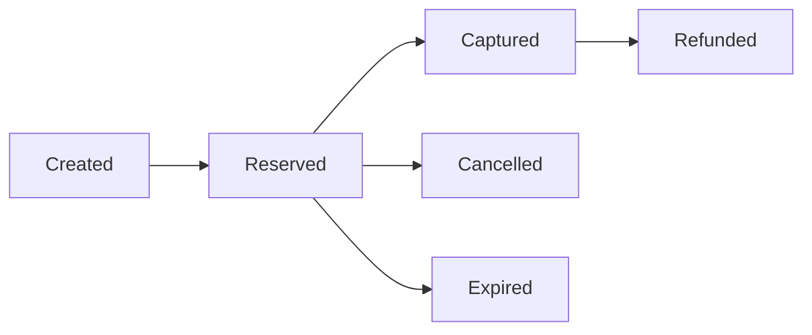

# Laravel MobilePay Vipps Package

[](https://packagist.org/packages/mrdulal/laravel-vipps)
[](https://packagist.org/packages/mrdulal/laravel-vipps)
[](https://github.com/mrdulal/Vipps-MobilePay/blob/main/LICENSE)
[](https://packagist.org/packages/mrdulal/laravel-vipps)
[](https://laravel.com)
[](https://github.com/mrdulal/Vipps-MobilePay/actions)

A comprehensive Laravel package for MobilePay Vipps payment integration with support for all major Vipps payment methods. This package provides a clean, modern API for integrating with the Vipps MobilePay payment platform used across Norway, Denmark, and Finland.

> **⚠️ Important Notice**: This is an **unofficial** package and is not affiliated with, endorsed by, or officially supported by MobilePay or Vipps. This package is developed independently by a solo developer for Laravel developers. For official MobilePay Vipps integration documentation, please visit the [Vipps Developer Portal](https://developer.vippsmobilepay.com/).

## 🎯 Features

### Payment Methods
- **🏪 MobilePay Vipps ePayment** - Standard payment method integration
- **🛒 MobilePay Vipps Checkout** - Complete checkout solution with card payments
- **⚡ MobilePay Vipps Express** - Quick checkout from product pages with QR codes
- **🔄 Recurring Payments** - Subscription and recurring payment support

### Management & Operations  
- **📊 Order Management API** - Capture, refund, cancel, and order management
- **🔗 Webhook Support** - Handle payment status updates automatically with signature verification
- **📡 Event-Driven Architecture** - Laravel events for all payment actions
- **🛡️ Security** - Built-in signature verification and request validation

### Developer Experience
- **✅ Comprehensive Testing** - Full test suite with PHPUnit and Orchestra Testbench
- **📚 Type Safety** - Full type hints and PHPDoc annotations
- **🔧 Configurable** - Extensive configuration options
- **🐞 Debugging** - Built-in logging and error handling
- **📦 Laravel Integration** - Service providers, facades, and Artisan commands

## 🌍 Countries Supported

| Country | Service | Market Penetration | Users |
|---------|---------|-------------------|-------|
| **🇳🇴 Norway** | Vipps | 77% population | 4.2M users |
| **🇩🇰 Denmark** | MobilePay | 75% population | 4.4M users |
| **🇫🇮 Finland** | MobilePay | 50% population | 2.8M users |

> **Total Market Reach:** 11+ million active users across Nordic countries

## 📋 Requirements

| Requirement | Version | Notes |
|-------------|---------|-------|
| **PHP** | 8.1+ | Uses modern PHP features like enums, readonly properties |
| **Laravel** | 9.0+ | Compatible with Laravel 9, 10, 11, and 12 |
| **Guzzle HTTP** | 7.0+ | For API communication |
| **ext-json** | * | JSON processing |
| **ext-openssl** | * | SSL/TLS support for API calls |

### Development Requirements
- **PHPUnit** 9.0+ or 10.0+
- **Orchestra Testbench** 7.0+, 8.0+, or 9.0+
- **Mockery** 1.4+ (for testing)

## 🚀 Installation

### 1. Install via Composer

#### From Packagist (Recommended)
```bash
composer require mrdulal/laravel-vipps
```

#### From GitHub Packages (Alternative)
See [GitHub Packages Installation Guide](GITHUB_PACKAGES.md) for detailed instructions on installing from GitHub Packages.

### 2. Publish Configuration

```bash
# Publish configuration file
php artisan vendor:publish --provider="Mrdulal\LaravelVipps\VippsServiceProvider" --tag="config"

# Publish migrations
php artisan vendor:publish --provider="Mrdulal\LaravelVipps\VippsServiceProvider" --tag="migrations"

# Publish views (optional)
php artisan vendor:publish --provider="Mrdulal\LaravelVipps\VippsServiceProvider" --tag="views"
```

### 3. Run Migrations

```bash
php artisan migrate
```

This will create the following tables:
- `vipps_payments` - Store payment records
- `vipps_recurring_agreements` - Store recurring payment agreements  
- `vipps_recurring_charges` - Store individual recurring charges

### 4. Laravel Auto-Discovery

The package uses Laravel's auto-discovery feature. The service provider and facade will be registered automatically.

**Manual Registration (if needed):**

```php
// config/app.php
'providers' => [
    // ...
    Mrdulal\LaravelVipps\VippsServiceProvider::class,
],

'aliases' => [
    // ...
    'Vipps' => Mrdulal\LaravelVipps\Facades\Vipps::class,
],
```

## ⚙️ Configuration

### Environment Variables

Add your Vipps credentials to your `.env` file:

```env
# Required: Basic Configuration
VIPPS_ENVIRONMENT=test                    # test or production
VIPPS_CLIENT_ID=your_client_id
VIPPS_CLIENT_SECRET=your_client_secret
VIPPS_SUBSCRIPTION_KEY=your_ocp_apim_subscription_key
VIPPS_MERCHANT_SERIAL_NUMBER=123456       # 6-digit MSN

# Required: Webhook Configuration
VIPPS_WEBHOOK_SECRET=your_webhook_secret

# Optional: Logging & Debugging
VIPPS_LOGGING_ENABLED=false
VIPPS_LOG_CHANNEL=default
VIPPS_LOG_LEVEL=info
```

### Configuration File

The package configuration is located at `config/vipps.php`. Key sections include:

```php
return [
    // Environment (test/production)
    'environment' => env('VIPPS_ENVIRONMENT', 'test'),
    
    // API Credentials
    'client_id' => env('VIPPS_CLIENT_ID'),
    'client_secret' => env('VIPPS_CLIENT_SECRET'),
    'subscription_key' => env('VIPPS_SUBSCRIPTION_KEY'),
    'merchant_serial_number' => env('VIPPS_MERCHANT_SERIAL_NUMBER'),
    
    // Feature toggles
    'features' => [
        'epayment' => true,
        'checkout' => true,
        'express' => true,
        'recurring' => true,
        'order_management' => true,
        'webhooks' => true,
    ],
    
    // HTTP client settings
    'http' => [
        'timeout' => 30,
        'connect_timeout' => 10,
        'verify' => true,
    ],
    
    // Express checkout UI settings
    'express' => [
        'button_theme' => 'orange',  // orange, white, white-outline
        'button_size' => 'large',    // small, medium, large
        'show_on_cart' => true,
        'show_on_product' => true,
    ],
];
```

## 🏁 Getting Started

### 1. Get Vipps MobilePay Account Keys

#### Step-by-Step Account Setup:

1. **Sign up** at [Vipps MobilePay Portal](https://portal.vippsmobilepay.com/)
2. **Wait for approval** (1-2 days) - you'll receive login details via email
3. **Access Developer Portal:**
   - Login to Vipps MobilePay Business Portal
   - Navigate to "Developer" tab
   - Select "Test Keys" for development or "Production Keys" for live environment
4. **Retrieve Credentials:**
   - **Merchant Serial Number (MSN)** - 6-digit number displayed prominently
   - **Client ID** - Click "Show keys" to reveal
   - **Client Secret** - Click "Show keys" to reveal  
   - **Subscription Key** - Listed as "Ocp-Apim-Subscription-Key"

#### Test vs Production

| Environment | Purpose | API Endpoint | Features |
|-------------|---------|--------------|----------|
| **Test** | Development & Testing | `https://apitest.vipps.no` | Full API access, test cards |
| **Production** | Live transactions | `https://api.vipps.no` | Real payments, KYC required |

### 2. Webhook Setup

Vipps requires a webhook endpoint for payment status updates:

```php
// routes/web.php or routes/api.php
Route::post('/vipps/webhook', [\Mrdulal\LaravelVipps\Http\Controllers\WebhookController::class, 'handle']);
```

**Register your webhook URL in the Vipps portal:**
- Format: `https://yourdomain.com/vipps/webhook`
- Must be HTTPS in production
- Must respond with HTTP 200 for successful processing

### 3. Basic Usage

#### ePayment (Standard Payment)

```php
use Mrdulal\LaravelVipps\Facades\Vipps;

// Create a payment
$payment = Vipps::ePayment()->create([
    'amount' => 10000, // Amount in øre (100.00 NOK)
    'currency' => 'NOK',
    'orderId' => 'order-123',
    'description' => 'Payment for order #123',
    'redirectUrl' => 'https://yoursite.com/payment/callback',
    'userFlow' => 'WEB_REDIRECT'
]);

// Get payment details
$details = Vipps::ePayment()->getPayment($payment['orderId']);

// Capture payment
$capture = Vipps::ePayment()->capture($payment['orderId'], [
    'amount' => 10000,
    'description' => 'Capture for order #123'
]);
```

#### Express Checkout

```php
use Mrdulal\LaravelVipps\Facades\Vipps;

// Create express checkout session
$session = Vipps::express()->create([
    'amount' => 10000,
    'currency' => 'NOK',
    'orderId' => 'order-123',
    'description' => 'Express checkout for order #123',
    'redirectUrl' => 'https://yoursite.com/express/callback',
    'userInfo' => [
        'userId' => 'user-123'
    ]
]);

// Generate QR code for express checkout
$qrCode = Vipps::express()->generateQrCode([
    'orderId' => 'order-123',
    'amount' => 10000,
    'currency' => 'NOK',
    'description' => 'Product purchase',
    'redirectUrl' => 'https://yoursite.com/callback',
    'qrFormat' => 'SVG', // or 'PNG'
    'qrSize' => 300
]);

// Create shareable payment link
$shareableLink = Vipps::express()->createShareableLink([
    'orderId' => 'order-456',
    'amount' => 15000,
    'currency' => 'NOK',
    'description' => 'Shareable payment link',
    'redirectUrl' => 'https://yoursite.com/callback',
    'expiresAt' => now()->addHours(24)
]);
```

#### Recurring Payments

```php
use Mrdulal\LaravelVipps\Facades\Vipps;

// Create recurring agreement
$agreement = Vipps::recurring()->createAgreement([
    'currency' => 'NOK',
    'price' => 9900, // 99.00 NOK
    'productName' => 'Monthly Subscription',
    'productDescription' => 'Premium subscription service',
    'merchantRedirectUrl' => 'https://yoursite.com/recurring/callback',
    'merchantAgreementUrl' => 'https://yoursite.com/agreement/123',
    'interval' => 'MONTH',
    'intervalCount' => 1,
    'isApp' => false
]);

// Create charge for agreement
$charge = Vipps::recurring()->createCharge($agreement['agreementId'], [
    'amount' => 9900,
    'currency' => 'NOK',
    'description' => 'Monthly subscription charge',
    'orderId' => 'charge-456'
]);

// List all charges for an agreement
$charges = Vipps::recurring()->listCharges($agreement['agreementId']);

// Stop an agreement
$result = Vipps::recurring()->stopAgreement($agreement['agreementId'], [
    'reason' => 'Customer requested cancellation'
]);
```

## 📚 API Reference

### Services Overview

| Service | Purpose | Key Methods |
|---------|---------|-------------|
| **ePayment** | Standard payments | `create()`, `capture()`, `refund()`, `cancel()` |
| **Express** | Quick checkout | `create()`, `generateQrCode()`, `createShareableLink()` |
| **Checkout** | Full checkout flow | `create()`, `updateSession()`, `getPaymentDetails()` |
| **Recurring** | Subscriptions | `createAgreement()`, `createCharge()`, `stopAgreement()` |
| **OrderManagement** | Payment operations | `capture()`, `refund()`, `cancel()`, `getPaymentHistory()` |
| **Webhook** | Event handling | `handleWebhook()`, `verifySignature()` |

### ePayment Service

#### Create Payment
```php
Vipps::ePayment()->create([
    'amount' => 10000,              // Required: Amount in øre (100.00 NOK)
    'currency' => 'NOK',            // Optional: NOK, DKK, EUR (default: NOK)
    'orderId' => 'order-123',       // Required: Unique order identifier
    'description' => 'Payment for order #123',  // Required: Payment description
    'redirectUrl' => 'https://yoursite.com/callback',  // Required: Callback URL
    'userFlow' => 'WEB_REDIRECT',   // Optional: WEB_REDIRECT, NATIVE_REDIRECT
    'paymentMethod' => 'WALLET',    // Optional: WALLET, CARD
    'skipLandingPage' => false,     // Optional: Skip Vipps landing page
    'userInfo' => [                 // Optional: Pre-fill user information
        'userId' => 'user-123',
        'mobileNumber' => '+4712345678',
        'email' => 'user@example.com'
    ],
    'reference' => 'ref-456'        // Optional: Your internal reference
]);
```

#### Capture Payment
```php
Vipps::ePayment()->capture('order-123', [
    'amount' => 10000,              // Required: Amount to capture
    'description' => 'Capture for order #123',  // Required
    'reference' => 'capture-ref'    // Optional
]);
```

#### Refund Payment
```php
Vipps::ePayment()->refund('order-123', [
    'amount' => 5000,               // Required: Amount to refund
    'description' => 'Partial refund',  // Required
    'reference' => 'refund-ref'     // Optional
]);
```

### Express Service

#### Generate QR Code
```php
Vipps::express()->generateQrCode([
    'orderId' => 'qr-order-123',
    'amount' => 15000,
    'currency' => 'NOK',
    'description' => 'QR Code Payment',
    'redirectUrl' => 'https://yoursite.com/callback',
    'qrFormat' => 'SVG',            // SVG or PNG
    'qrSize' => 300                 // Size in pixels (100-2000)
]);
```

#### Create Shareable Link
```php
Vipps::express()->createShareableLink([
    'orderId' => 'share-order-123',
    'amount' => 20000,
    'currency' => 'NOK',
    'description' => 'Shareable Payment Link',
    'redirectUrl' => 'https://yoursite.com/callback',
    'expiresAt' => now()->addDays(7)  // Optional: Link expiration
]);
```

### Recurring Service

#### Create Agreement
```php
Vipps::recurring()->createAgreement([
    'currency' => 'NOK',
    'price' => 9900,                // Monthly price in øre
    'productName' => 'Premium Plan', // Max 45 characters
    'productDescription' => 'Monthly premium subscription',  // Max 100 chars
    'merchantRedirectUrl' => 'https://yoursite.com/recurring/success',
    'merchantAgreementUrl' => 'https://yoursite.com/terms',
    'interval' => 'MONTH',          // WEEK, MONTH, YEAR
    'intervalCount' => 1,           // How many intervals between charges
    'isApp' => false,               // True if initiated from mobile app
    'phoneNumber' => '+4712345678', // Optional: Pre-fill phone
    'campaign' => [                 // Optional: Campaign pricing
        'start' => now(),
        'end' => now()->addMonths(3),
        'price' => 4900             // Campaign price in øre
    ]
]);
```

### Order Management Service

#### Get Payment History
```php
$history = Vipps::orderManagement()->getPaymentHistory('order-123');
// Returns array of all transactions for the order
```

#### Send Receipt
```php
Vipps::orderManagement()->sendReceipt('order-123', [
    'orderLines' => [
        [
            'name' => 'Premium Subscription',
            'id' => 'sub-001',
            'totalAmount' => 9900,
            'totalAmountExcludingTax' => 7920,
            'totalTaxAmount' => 1980,
            'taxRate' => 25.0,
            'unitInfo' => [
                'unitPrice' => 9900,
                'quantity' => '1',
                'quantityUnit' => 'month'
            ]
        ]
    ],
    'bottomLine' => [
        'currency' => 'NOK',
        'tipAmount' => 500,
        'barcode' => [
            'format' => 'EAN-13',
            'data' => '1234567890123'
        ]
    ]
]);
```

## 🔗 Webhook Handling

### Setup Webhook Route

```php
// routes/web.php or routes/api.php
Route::post('/vipps/webhook', [\Mrdulal\LaravelVipps\Http\Controllers\WebhookController::class, 'handle']);
```

### Event Listeners

```php
// app/Providers/EventServiceProvider.php
use Mrdulal\LaravelVipps\Events\{
    PaymentCompleted,
    PaymentCancelled,
    PaymentCaptured,
    PaymentRefunded,
    RecurringAgreementCreated,
    RecurringChargeCreated
};

protected $listen = [
    PaymentCompleted::class => [
        \App\Listeners\HandlePaymentCompleted::class,
    ],
    PaymentCancelled::class => [
        \App\Listeners\HandlePaymentCancelled::class,
    ],
    PaymentCaptured::class => [
        \App\Listeners\HandlePaymentCaptured::class,
    ],
    PaymentRefunded::class => [
        \App\Listeners\HandlePaymentRefunded::class,
    ],
    RecurringAgreementCreated::class => [
        \App\Listeners\HandleRecurringAgreementCreated::class,
    ],
    RecurringChargeCreated::class => [
        \App\Listeners\HandleRecurringChargeCreated::class,
    ],
];
```

### Event Listener Example

```php
<?php

namespace App\Listeners;

use Mrdulal\LaravelVipps\Events\PaymentCompleted;
use Illuminate\Contracts\Queue\ShouldQueue;

class HandlePaymentCompleted implements ShouldQueue
{
    public function handle(PaymentCompleted $event): void
    {
        $orderId = $event->orderId;
        $payload = $event->payload;
        
        // Update your order status
        $order = Order::where('order_id', $orderId)->first();
        if ($order) {
            $order->update(['status' => 'paid']);
            
            // Send confirmation email
            Mail::to($order->customer_email)->send(new PaymentConfirmation($order));
        }
    }
}
```

### Webhook Security

The package automatically verifies webhook signatures using HMAC-SHA256:

```php
// Webhook verification is automatic, but you can customize it
'webhook' => [
    'secret' => env('VIPPS_WEBHOOK_SECRET'),
    'tolerance' => 300,              // 5 minutes tolerance
    'verify_signature' => true,      // Enable signature verification
],
```

## 🎭 Events

The package fires Laravel events for all major payment actions:

| Event | Trigger | Payload |
|-------|---------|---------|
| `PaymentCreated` | Payment initiated | `orderId`, webhook `payload` |
| `PaymentCompleted` | Payment authorized/completed | `orderId`, webhook `payload` |
| `PaymentCancelled` | Payment cancelled | `orderId`, webhook `payload` |
| `PaymentCaptured` | Payment captured | `orderId`, webhook `payload` |
| `PaymentRefunded` | Payment refunded | `orderId`, webhook `payload` |
| `RecurringAgreementCreated` | Recurring agreement created | `agreementId`, webhook `payload` |
| `RecurringChargeCreated` | Recurring charge created | `chargeId`, webhook `payload` |

### Custom Event Handling

```php
// Listen to all Vipps events with a single listener
Event::listen('Mrdulal\LaravelVipps\Events\*', function ($eventName, array $data) {
    $eventObject = $data[0];
    Log::info("Vipps event fired: {$eventName}", [
        'order_id' => $eventObject->orderId,
        'payload' => $eventObject->payload
    ]);
});
```

## 🧪 Testing

### Running Tests

```bash
# Run all tests
composer test

# Run tests with coverage report
composer test-coverage

# Run specific test file
./vendor/bin/phpunit tests/Unit/VippsClientTest.php

# Run tests with verbose output
./vendor/bin/phpunit --verbose
```

### Writing Tests

The package provides a comprehensive test suite. Here's how to test your Vipps integration:

#### Mock Vipps Responses

```php
<?php

namespace Tests\Feature;

use Tests\TestCase;
use Mrdulal\LaravelVipps\Facades\Vipps;
use Mrdulal\LaravelVipps\Services\VippsClient;
use Mockery;

class VippsPaymentTest extends TestCase
{
    public function test_can_create_payment()
    {
        // Mock the VippsClient
        $mockClient = Mockery::mock(VippsClient::class);
        $mockClient->shouldReceive('post')
            ->once()
            ->with('https://apitest.vipps.no/ecomm/v2/payments', Mockery::type('array'))
            ->andReturn([
                'orderId' => 'test-order-123',
                'url' => 'https://test.vipps.no/redirect-url',
                'token' => 'test-token'
            ]);

        $this->app->instance(VippsClient::class, $mockClient);

        // Test payment creation
        $response = Vipps::ePayment()->create([
            'amount' => 10000,
            'currency' => 'NOK',
            'orderId' => 'test-order-123',
            'description' => 'Test payment',
            'redirectUrl' => 'https://example.com/callback'
        ]);

        $this->assertEquals('test-order-123', $response['orderId']);
        $this->assertArrayHasKey('url', $response);
    }
}
```

#### Test Webhook Handling

```php
<?php

namespace Tests\Feature;

use Tests\TestCase;
use Mrdulal\LaravelVipps\Events\PaymentCompleted;
use Illuminate\Support\Facades\Event;

class WebhookTest extends TestCase
{
    public function test_payment_completed_webhook()
    {
        Event::fake();

        $payload = [
            'eventType' => 'SALE',
            'transactionInfo' => [
                'orderId' => 'test-order-123',
                'amount' => 10000,
                'status' => 'COMPLETED'
            ]
        ];

        $response = $this->postJson('/vipps/webhook', $payload);

        $response->assertStatus(200);
        Event::assertDispatched(PaymentCompleted::class);
    }
}
```

#### Test Environment Configuration

```php
// phpunit.xml
<phpunit>
    <php>
        <env name="VIPPS_ENVIRONMENT" value="test"/>
        <env name="VIPPS_CLIENT_ID" value="test_client_id"/>
        <env name="VIPPS_CLIENT_SECRET" value="test_client_secret"/>
        <env name="VIPPS_SUBSCRIPTION_KEY" value="test_subscription_key"/>
        <env name="VIPPS_MERCHANT_SERIAL_NUMBER" value="123456"/>
    </php>
</phpunit>
```

## 🛠️ Advanced Configuration

### Complete Configuration Options

```php
// config/vipps.php
return [
    // Environment & Credentials
    'environment' => env('VIPPS_ENVIRONMENT', 'test'),
    'client_id' => env('VIPPS_CLIENT_ID'),
    'client_secret' => env('VIPPS_CLIENT_SECRET'),
    'subscription_key' => env('VIPPS_SUBSCRIPTION_KEY'),
    'merchant_serial_number' => env('VIPPS_MERCHANT_SERIAL_NUMBER'),

    // API Endpoints (auto-configured based on environment)
    'api_endpoints' => [
        'test' => [
            'base_url' => 'https://apitest.vipps.no',
            'ecom_url' => 'https://apitest.vipps.no/ecomm/v2',
            'checkout_url' => 'https://apitest.vipps.no/checkout/v3',
            'recurring_url' => 'https://apitest.vipps.no/recurring/v3',
            'order_management_url' => 'https://apitest.vipps.no/order-management/v1',
        ],
        'production' => [
            'base_url' => 'https://api.vipps.no',
            'ecom_url' => 'https://api.vipps.no/ecomm/v2',
            'checkout_url' => 'https://api.vipps.no/checkout/v3',
            'recurring_url' => 'https://api.vipps.no/recurring/v3',
            'order_management_url' => 'https://api.vipps.no/order-management/v1',
        ],
    ],

    // HTTP Client Settings
    'http' => [
        'timeout' => 30,                // Request timeout in seconds
        'connect_timeout' => 10,        // Connection timeout
        'verify' => true,               // SSL certificate verification
        'headers' => [
            'Content-Type' => 'application/json',
            'Accept' => 'application/json',
        ],
    ],

    // Webhook Security
    'webhook' => [
        'secret' => env('VIPPS_WEBHOOK_SECRET'),
        'tolerance' => 300,             // 5 minutes tolerance for timestamp
        'verify_signature' => true,     // Enable HMAC signature verification
    ],

    // Default Payment Settings
    'defaults' => [
        'currency' => 'NOK',
        'country' => 'NO',
        'language' => 'no',
        'skip_landing_page' => false,
        'user_flow' => 'WEB_REDIRECT',
    ],

    // Recurring Payment Limits
    'recurring' => [
        'default_interval' => 'MONTH',
        'default_interval_count' => 1,
        'max_amount' => 200000,         // 2000.00 NOK in øre
        'default_currency' => 'NOK',
    ],

    // Express Checkout UI
    'express' => [
        'enabled' => true,
        'button_theme' => 'orange',     // orange, white, white-outline
        'button_size' => 'large',       // small, medium, large
        'show_on_cart' => true,
        'show_on_product' => true,
        'show_on_category' => false,
    ],

    // Logging & Debugging
    'logging' => [
        'enabled' => env('VIPPS_LOGGING_ENABLED', false),
        'channel' => env('VIPPS_LOG_CHANNEL', 'default'),
        'level' => env('VIPPS_LOG_LEVEL', 'info'),
        'log_requests' => true,         // Log API requests
        'log_responses' => true,        // Log API responses
        'log_headers' => false,         // Log headers (may contain sensitive data)
    ],

    // Caching (for access tokens)
    'cache' => [
        'enabled' => true,
        'ttl' => 3600,                  // 1 hour cache TTL
        'prefix' => 'vipps_',
        'store' => null,                // Use default cache store
    ],

    // Error Handling
    'error_handling' => [
        'retry_attempts' => 3,
        'retry_delay' => 1000,          // milliseconds
        'throw_on_error' => true,
    ],

    // Feature Toggles
    'features' => [
        'epayment' => true,
        'checkout' => true,
        'express' => true,
        'recurring' => true,
        'order_management' => true,
        'webhooks' => true,
    ],
];
```

## 🎯 Order Management & Payment Lifecycle

### Payment States & Transitions



### Comprehensive Order Management

```php
// Capture full or partial amount
$capture = Vipps::orderManagement()->capture('order-123', [
    'amount' => 5000,               // Partial capture (original: 10000)
    'description' => 'Partial shipment - Item 1'
]);

// Multiple captures are allowed until full amount is captured
$capture2 = Vipps::orderManagement()->capture('order-123', [
    'amount' => 5000,               // Remaining amount
    'description' => 'Final shipment - Item 2'
]);

// Refund captured payment
$refund = Vipps::orderManagement()->refund('order-123', [
    'amount' => 2000,               // Partial refund
    'description' => 'Product return - defective item'
]);

// Cancel uncaptured payment
$cancel = Vipps::orderManagement()->cancel('order-123', [
    'description' => 'Order cancelled by customer'
]);

// Get complete payment history
$history = Vipps::orderManagement()->getPaymentHistory('order-123');
// Returns: reservations, captures, refunds, cancellations

// Get current order status
$status = Vipps::orderManagement()->getOrderStatus('order-123');
```

### Payment Reservations & Timeouts

| Payment Method | Reservation Period | Auto-Cancel |
|----------------|-------------------|-------------|
| **Vipps** | 180 days | Yes |
| **MobilePay** | 14 days | Yes |
| **Credit Card** (via Checkout) | 7 days | Yes |

> ⚠️ **Important:** Capture payments before the reservation expires to avoid automatic cancellation.

## ⚠️ Error Handling & Troubleshooting

### Exception Hierarchy

```php
VippsException                    // Base exception
├── VippsApiException            // API-related errors
├── VippsValidationException     // Input validation errors
└── Custom exceptions...
```

### Comprehensive Error Handling

```php
use Mrdulal\LaravelVipps\Exceptions\{VippsException, VippsValidationException, VippsApiException};

try {
    $payment = Vipps::ePayment()->create($paymentData);
} catch (VippsValidationException $e) {
    // Handle validation errors (400-level client errors)
    $errors = $e->getValidationErrors();
    
    foreach ($errors as $field => $messages) {
        Log::warning("Validation error on {$field}: " . implode(', ', $messages));
    }
    
    return response()->json(['errors' => $errors], 422);
    
} catch (VippsApiException $e) {
    // Handle API errors (Vipps API returned an error)
    $apiError = $e->getApiError();
    $statusCode = $e->getCode();
    
    Log::error('Vipps API Error', [
        'status_code' => $statusCode,
        'error' => $apiError,
        'message' => $e->getMessage()
    ]);
    
    // Handle specific API errors
    switch ($statusCode) {
        case 401:
            // Unauthorized - check credentials
            break;
        case 403:
            // Forbidden - check permissions
            break;
        case 429:
            // Rate limited - implement backoff
            break;
        case 500:
            // Server error - retry later
            break;
    }
    
} catch (VippsException $e) {
    // Handle general Vipps errors (network issues, etc.)
    Log::error('Vipps General Error: ' . $e->getMessage());
    
} catch (\Exception $e) {
    // Handle unexpected errors
    Log::critical('Unexpected error in Vipps integration', [
        'exception' => $e->getMessage(),
        'trace' => $e->getTraceAsString()
    ]);
}
```

### Common Error Scenarios

#### 1. Authentication Errors
```php
// Error: Invalid credentials
[
    'code' => 401,
    'message' => 'Access denied',
    'details' => 'Invalid client credentials'
]

// Solution: Verify your credentials in .env file
```

#### 2. Validation Errors
```php
// Error: Invalid amount
[
    'field' => 'amount',
    'errors' => ['The amount must be at least 100 øre (1.00 NOK)']
]

// Solution: Ensure amount is in øre (multiply by 100)
$amount = 99.50 * 100; // 9950 øre
```

#### 3. Order ID Conflicts
```php
// Error: Duplicate order ID
[
    'code' => 409,
    'message' => 'Order ID already exists'
]

// Solution: Ensure unique order IDs
$orderId = 'order-' . time() . '-' . uniqid();
```

### Debugging Tools

#### Enable Logging
```env
VIPPS_LOGGING_ENABLED=true
VIPPS_LOG_LEVEL=debug
```

#### View Logs
```bash
# View Vipps-specific logs
tail -f storage/logs/laravel.log | grep -i vipps

# Or use Laravel's log viewer
php artisan log:monitor
```

#### Test API Connectivity
```php
// Test basic API connectivity
try {
    $client = app(VippsClient::class);
    $token = $client->getAccessToken();
    echo "✅ API connection successful. Token: " . substr($token, 0, 20) . "...";
} catch (Exception $e) {
    echo "❌ API connection failed: " . $e->getMessage();
}
```

### Production Checklist

- [ ] **Environment**: Set `VIPPS_ENVIRONMENT=production`
- [ ] **Credentials**: Use production API keys
- [ ] **HTTPS**: Ensure webhook URL uses HTTPS
- [ ] **Webhook**: Test webhook endpoint responds with HTTP 200
- [ ] **Signature**: Verify webhook signature validation is enabled
- [ ] **Logging**: Disable detailed logging in production
- [ ] **Error Handling**: Implement proper error handling for all payment flows
- [ ] **Monitoring**: Set up alerts for payment failures

### Common Issues & Solutions

| Issue | Cause | Solution |
|-------|-------|----------|
| **"Access denied"** | Wrong credentials | Verify API keys in Vipps portal |
| **"Invalid amount"** | Amount < 100 øre | Ensure minimum 1.00 NOK (100 øre) |
| **"Order ID exists"** | Duplicate order ID | Use unique order identifiers |
| **"Webhook failed"** | Invalid signature | Check webhook secret configuration |
| **"Payment expired"** | Not captured in time | Capture within reservation period |
| **"Merchant not found"** | Wrong MSN | Verify Merchant Serial Number |

## 🎨 Frontend Integration

### Express Checkout Button

The package includes a pre-built Blade component for express checkout:

```blade
{{-- resources/views/checkout.blade.php --}}
@include('vipps::express-button', [
    'amount' => 9900,
    'currency' => 'NOK',
    'orderId' => 'order-' . time(),
    'description' => 'Product purchase',
    'redirectUrl' => route('payment.callback'),
    'theme' => 'orange',        // orange, white, white-outline
    'size' => 'large',          // small, medium, large
    'text' => 'Buy with Vipps'
])
```

### Custom Frontend Implementation

```javascript
// Custom JavaScript integration
async function createVippsPayment(paymentData) {
    try {
        const response = await fetch('/api/vipps/payment/create', {
            method: 'POST',
            headers: {
                'Content-Type': 'application/json',
                'X-CSRF-TOKEN': document.querySelector('meta[name="csrf-token"]').content
            },
            body: JSON.stringify(paymentData)
        });

        const result = await response.json();
        
        if (result.url) {
            // Redirect to Vipps
            window.location.href = result.url;
        } else {
            throw new Error('Payment creation failed');
        }
    } catch (error) {
        console.error('Payment error:', error);
        showErrorMessage('Payment failed. Please try again.');
    }
}

// Usage
document.getElementById('vipps-pay-button').addEventListener('click', () => {
    createVippsPayment({
        amount: 9900,
        currency: 'NOK',
        orderId: 'order-' + Date.now(),
        description: 'Product purchase',
        redirectUrl: '/payment/callback'
    });
});
```

### React/Vue.js Integration

```jsx
// React component example
import { useState } from 'react';

const VippsPaymentButton = ({ amount, orderId, description }) => {
    const [loading, setLoading] = useState(false);

    const handlePayment = async () => {
        setLoading(true);
        
        try {
            const response = await fetch('/api/vipps/payment/create', {
                method: 'POST',
                headers: {
                    'Content-Type': 'application/json',
                    'X-CSRF-TOKEN': document.querySelector('meta[name="csrf-token"]').content
                },
                body: JSON.stringify({
                    amount,
                    orderId,
                    description,
                    currency: 'NOK',
                    redirectUrl: window.location.origin + '/payment/callback'
                })
            });

            const result = await response.json();
            if (result.url) {
                window.location.href = result.url;
            }
        } catch (error) {
            console.error('Payment failed:', error);
        } finally {
            setLoading(false);
        }
    };

    return (
        <button 
            onClick={handlePayment}
            disabled={loading}
            className="vipps-button"
        >
            {loading ? 'Processing...' : 'Pay with Vipps'}
        </button>
    );
};
```

## 🚀 Deployment Guide

### Environment Setup

#### Production Environment Variables
```env
# Production Configuration
VIPPS_ENVIRONMENT=production
VIPPS_CLIENT_ID=your_production_client_id
VIPPS_CLIENT_SECRET=your_production_client_secret
VIPPS_SUBSCRIPTION_KEY=your_production_subscription_key
VIPPS_MERCHANT_SERIAL_NUMBER=your_production_msn

# Webhook Security
VIPPS_WEBHOOK_SECRET=your_production_webhook_secret

# Performance & Monitoring
VIPPS_LOGGING_ENABLED=true
VIPPS_LOG_LEVEL=error
```

#### Server Requirements
- **PHP 8.1+** with extensions: `json`, `openssl`, `curl`
- **HTTPS required** for production webhooks
- **Firewall**: Allow outbound HTTPS (443) to `api.vipps.no`
- **Memory**: Minimum 128MB PHP memory limit

### Docker Deployment

```dockerfile
# Dockerfile
FROM php:8.1-fpm-alpine

# Install required extensions
RUN docker-php-ext-install json openssl

# Install Composer
COPY --from=composer:latest /usr/bin/composer /usr/bin/composer

# Copy application
COPY . /var/www/html
WORKDIR /var/www/html

# Install dependencies
RUN composer install --no-dev --optimize-autoloader

# Set permissions
RUN chown -R www-data:www-data /var/www/html
```

```yaml
# docker-compose.yml
version: '3.8'
services:
  app:
    build: .
    environment:
      - VIPPS_ENVIRONMENT=production
      - VIPPS_CLIENT_ID=${VIPPS_CLIENT_ID}
      - VIPPS_CLIENT_SECRET=${VIPPS_CLIENT_SECRET}
      - VIPPS_SUBSCRIPTION_KEY=${VIPPS_SUBSCRIPTION_KEY}
      - VIPPS_MERCHANT_SERIAL_NUMBER=${VIPPS_MERCHANT_SERIAL_NUMBER}
      - VIPPS_WEBHOOK_SECRET=${VIPPS_WEBHOOK_SECRET}
    ports:
      - "80:80"
      - "443:443"
```

### Load Balancer Configuration

```nginx
# nginx.conf
upstream laravel {
    server app1:9000;
    server app2:9000;
}

server {
    listen 443 ssl;
    server_name yourdomain.com;

    # SSL configuration
    ssl_certificate /path/to/certificate.pem;
    ssl_certificate_key /path/to/private.key;

    # Webhook endpoint
    location /vipps/webhook {
        proxy_pass http://laravel;
        proxy_set_header Host $host;
        proxy_set_header X-Real-IP $remote_addr;
        proxy_set_header X-Forwarded-For $proxy_add_x_forwarded_for;
        proxy_set_header X-Forwarded-Proto $scheme;
        
        # Important: Preserve request body for signature verification
        proxy_request_buffering off;
    }
}
```

### Monitoring & Alerting

```php
// app/Console/Commands/VippsHealthCheck.php
<?php

namespace App\Console\Commands;

use Illuminate\Console\Command;
use Mrdulal\LaravelVipps\Services\VippsClient;

class VippsHealthCheck extends Command
{
    protected $signature = 'vipps:health-check';
    protected $description = 'Check Vipps API connectivity';

    public function handle()
    {
        try {
            $client = app(VippsClient::class);
            $token = $client->getAccessToken();
            
            $this->info('✅ Vipps API is accessible');
            $this->info('Token: ' . substr($token, 0, 20) . '...');
            
            return 0;
        } catch (\Exception $e) {
            $this->error('❌ Vipps API check failed: ' . $e->getMessage());
            return 1;
        }
    }
}
```

```bash
# Cron job for health checks
# /etc/cron.d/vipps-health-check
*/5 * * * * php /path/to/artisan vipps:health-check || echo "Vipps API down" | mail -s "Alert: Vipps API Issue" admin@yourdomain.com
```

## 📊 Performance Optimization

### Caching Strategy

```php
// Optimize access token caching
'cache' => [
    'enabled' => true,
    'ttl' => 3600,              // 1 hour (tokens are valid for 1 hour)
    'store' => 'redis',         // Use Redis for better performance
],
```

### Queue Configuration

```php
// Queue webhook processing for better performance
// app/Listeners/HandlePaymentCompleted.php
class HandlePaymentCompleted implements ShouldQueue
{
    use Dispatchable, InteractsWithQueue, Queueable, SerializesModels;

    public $queue = 'vipps-webhooks';
    public $timeout = 60;
    public $tries = 3;

    public function handle(PaymentCompleted $event): void
    {
        // Process payment completion
    }
}
```

### Database Optimization

```php
// Add indexes for better query performance
Schema::table('vipps_payments', function (Blueprint $table) {
    $table->index(['status', 'created_at']);
    $table->index(['merchant_serial_number', 'order_id']);
});
```

## 📚 Resources & References

### Official Documentation
- **[Vipps MobilePay Developer Portal](https://developer.vippsmobilepay.com/)** - Official API documentation
- **[Vipps MobilePay Business Portal](https://portal.vippsmobilepay.com/)** - Get API credentials
- **[API Reference](https://developer.vippsmobilepay.com/api/)** - Complete API specification

### Laravel Resources
- **[Laravel Package Development](https://laravel.com/docs/packages)** - Official Laravel documentation
- **[Service Providers](https://laravel.com/docs/providers)** - Understanding Laravel service providers
- **[Events & Listeners](https://laravel.com/docs/events)** - Laravel event system

### Community & Support
- **[GitHub Issues](https://github.com/mrdulal/laravel-vipps/issues)** - Bug reports and feature requests
- **[Discussions](https://github.com/mrdulal/laravel-vipps/discussions)** - Community discussions
- **[Stack Overflow](https://stackoverflow.com/questions/tagged/vipps+laravel)** - Q&A with the community

## 🤝 Contributing

We welcome contributions! Please see [CONTRIBUTING.md](CONTRIBUTING.md) for details on:

- Development setup
- Coding standards (PSR-12)
- Testing requirements
- Pull request process
- Code review guidelines

### Quick Contribution Guide

```bash
# 1. Fork and clone the repository
git clone https://github.com/yourusername/laravel-vipps.git
cd laravel-vipps

# 2. Install dependencies
composer install

# 3. Run tests
composer test

# 4. Make your changes and add tests
# 5. Ensure all tests pass
composer test

# 6. Submit a pull request
```

## 🔒 Security

### Reporting Security Vulnerabilities

Please **DO NOT** report security vulnerabilities through public GitHub issues. Instead:

1. Email security issues to: **security@example.com**
2. Include detailed information about the vulnerability
3. Allow reasonable time for response before public disclosure

### Security Best Practices

- Always use HTTPS in production
- Keep webhook secrets secure and rotate regularly
- Validate all webhook signatures
- Log security events for monitoring
- Keep the package updated to latest version

## 📄 License

The MIT License (MIT). Please see [License File](LICENSE.md) for more information.

## 🏆 Credits

### Core Contributors
- **[Mr Dulal](https://github.com/mrdulal)** - Package author and maintainer

### Acknowledgments
- **Vipps MobilePay** - For providing the payment platform and API
- **Laravel Framework** - For the excellent framework and ecosystem
- **Solo Development** - This package is built and maintained by a single developer

---

<div align="center">

**⭐ Star this repository if it helped you!**

[Report Bug](https://github.com/mrdulal/laravel-vipps/issues) • [Request Feature](https://github.com/mrdulal/laravel-vipps/issues) • [Documentation](https://github.com/mrdulal/laravel-vipps/wiki)

</div>